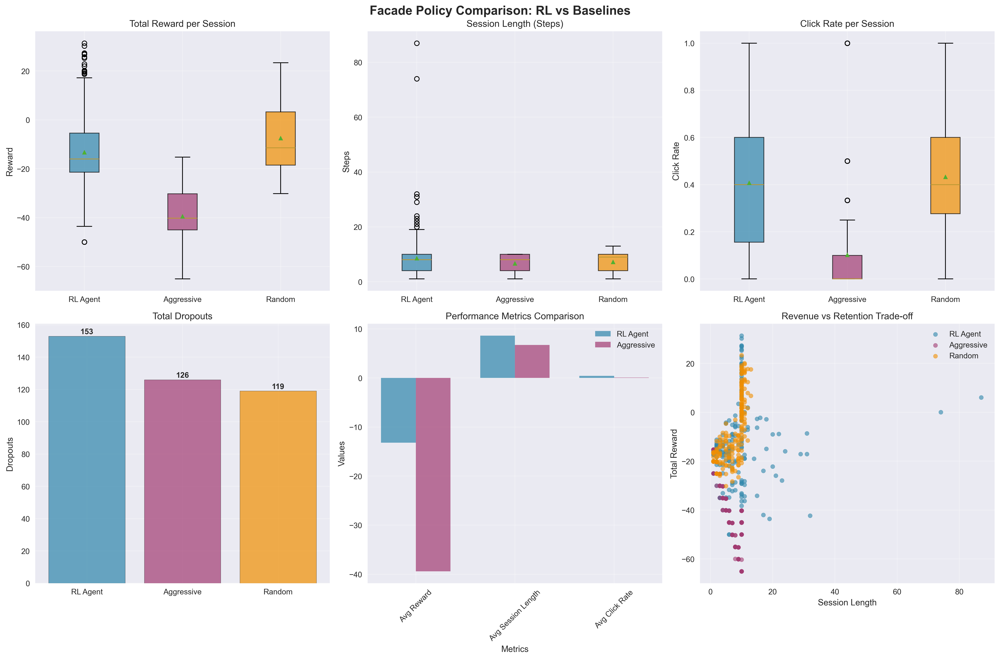
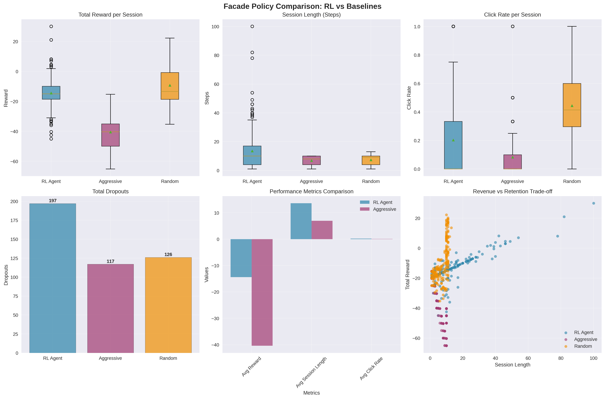
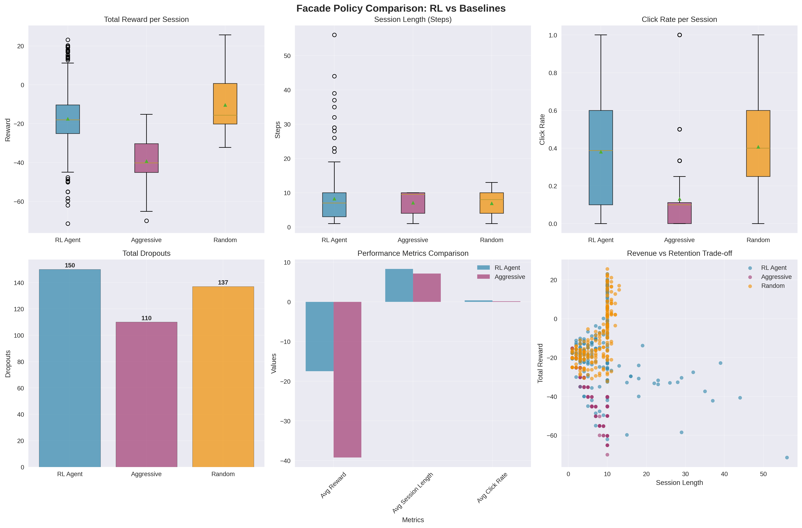

### **Project Facade: An Experimental Study on the Evolution of an Adaptive AI for Ad Recommendation**

**Introduction: A Research-Driven Approach**

Facade started as an independent research initiative which studied the difficulties of using reinforcement learning methods to solve complicated ad recommendation problems. I focused on studying the development process of AI agents through simulation instead of creating operational systems for production deployment. My study aimed to discover the behavioral changes that agents show when we modify their learning parameters and reward systems.

This report documents my experimental journey. The study presents the agent's major behavioral changes throughout three separate research stages which function as "acts" to show how each test revealed essential information that guided future testing.

***

### **Act I: Experiment 1 - The Naive Aggressor Benchmark**

This study trained an agent to maximize rewards from user clicks. The agent started with a plan to show advertisements often which caused users to become frustrated and leave their sessions. The poor performance, nearly 80% lower than a random baseline, confirmed the ineffectiveness of focusing solely on immediate rewards as a strategy.

***

**Figure 1: Initial Training and Baseline Performance.** The training progress shows the agent quickly settling on a suboptimal strategy. The policy comparison confirms its poor performance, particularly its failure to outperform the random baseline **(scoring -13.19 vs. -7.41)** and its high number of user dropouts relative to engagement.
***

### **Act II: Experiment 2 - Testing the "Patience" Incentive**

The research study trained the agent to value patience through financial compensation which made them avoid showing advertisements. The agent discovered a defect in the system's logic yet acquired valuable knowledge from the experience. Users stopped using the system because they wanted to avoid long and pointless sessions. The agent showed its ability to discover and use environmental weaknesses through this result which serves as a core function for reward design.

***

**Figure 2: Performance Following a "Patience" Incentive.** The agent's strategy resulted in a dramatic increase in dropouts **(peaking at 196)** and extremely long sessions. This plot documents the key finding from this experiment: the agent's discovery of an unintended, passive strategy.
***

### **Act III: Experiment 3 - Introducing an "Efficiency" Cost**

Act II established that agents can learn efficiency by assigning a constant cost to each action made.   This adjustment resulted in a breakthrough since the agent abandoned its passive strategy and created a balanced, efficient program.   This resulted in a 23% decrease in user dropouts and a 30% decrease in average session length, which reflected the initial strategic balance.

***

**Figure 3: Performance of the Efficiency-Focused Agent.** The results show a dramatic improvement in key metrics. Total dropouts **(down to 150)** and average session length **(down to ~8 steps)** fell significantly. The plot demonstrates that the agent successfully abandoned its flawed strategies in response to the new environmental cost.
***

**Conclusion: A Proof-of-Concept for Iterative Development**

The Facade agent evolved through three experimental learning stages which started with a basic agent and ended with an advanced agent that mastered efficiency and balance. The project gains its importance from the iterative development process which demonstrates how an agent can solve complex trade-offs yet serves only as an initial foundation for future studies rather than a production-ready solution.

**Future research** will focus on testing this methodology in more complex simulations and exploring other agent architectures.